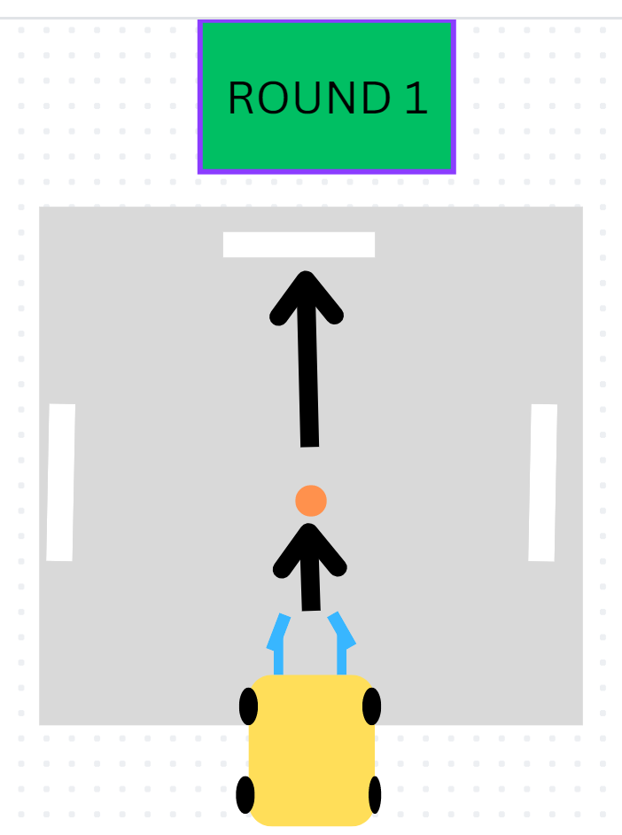
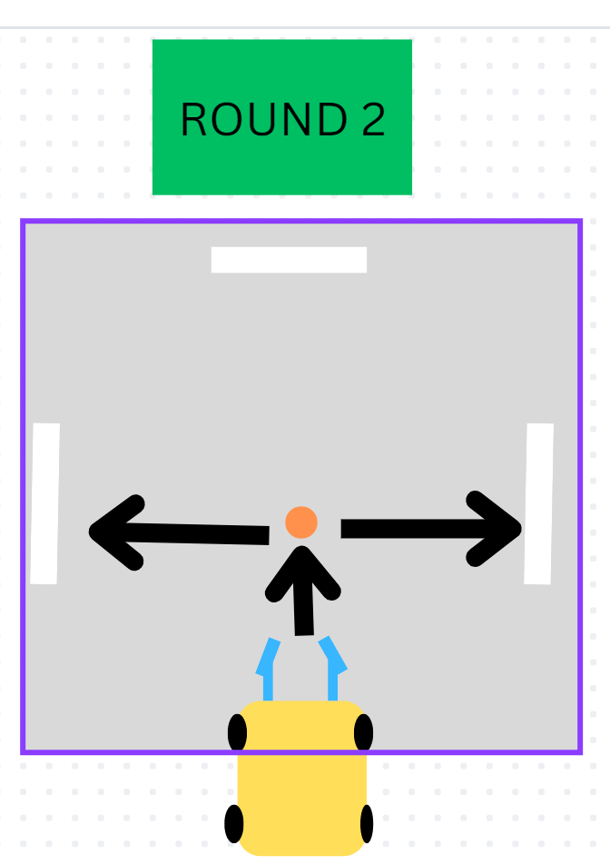
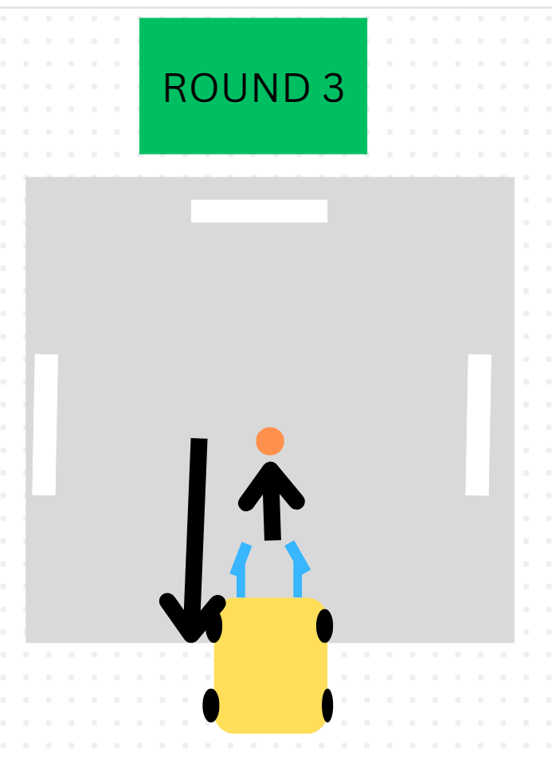

# Lego Spike Soccer Bot Game Instructions

## The Game

The objective of the game is to build and program a wheeled robot that is able to capture and maneuver a game ball in different directions.

There will be three phases of the game.

In the first phase the robot will move in a straight direction to capture the ball and continue in a straight line to push the ball across the finish line.

In the 2nd phase, the bot will move forward to capture the ball, make a 90 degree turn and deliver the ball across an adjacent finish line.

In the 3rd phase, the bot will move forward to capture the ball,
make a 180 degree turn and deliver the ball across the originating finish line.

