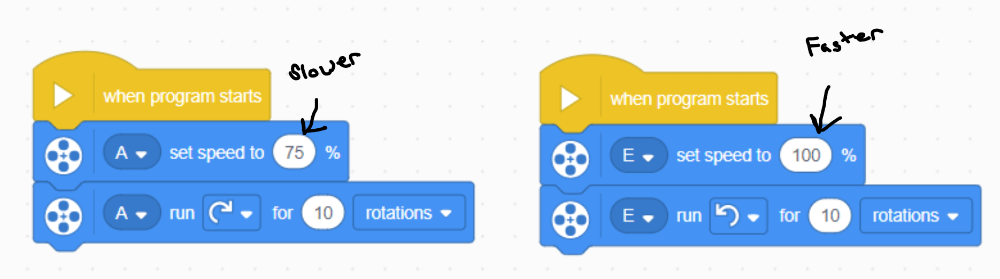
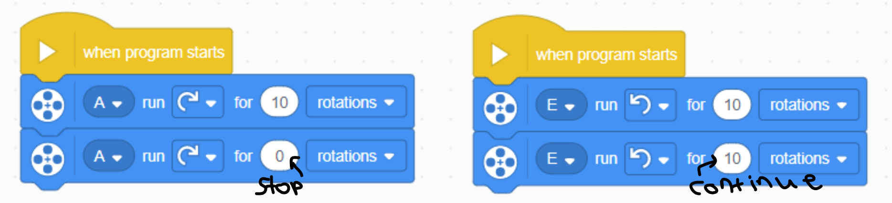
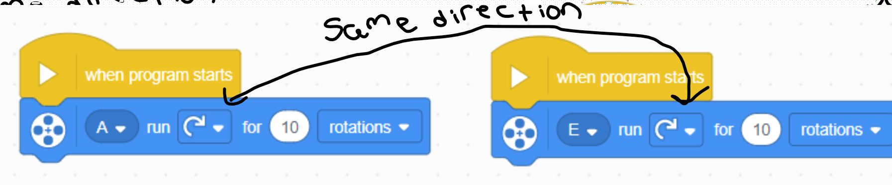
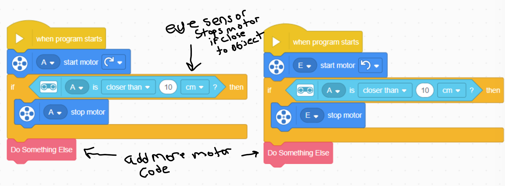

# Lego Spike Soccer Bot Programming Instructions

## Starting A Program

> Use the "When Program Starts" block
> 
>
> > this block sets the instructions for what the motors or sensors should do when the play button is pressed in the software or the program button is pressed on the top of the robot brain.

## Turning a wheel or tire

> Connect a blue turn motor block to a "When program starts" block. You can set the number of rotations, the rotation direction and the motor connection letter from here.
>
> > In the code block below the motor connected to the "A" port will turn clockwise for 10 rotations.
> > 

## Driving a two-wheeled bot forward

> In order to drive a vehicle forward, the two front tires need to spin in opposite "clock" directions. If you connect motor turn blocks together from top to bottom they will run one at a item, in order. This is not the behavior we want.
>
> One option is to attach different motor turn blocks to separate "When Program Starts" blocks.
> 
>
> In the previous image the motor on port "A" will spin clockwise for 10 rotations and the motor on port "E" will spin counter-clockwise for 10 rotations. This will cause the bot to drive forward for 10 rotations.

## Turning a bot

There are multiple options to turn a wheeled robot.

> The first option is to make one motor turn faster than the opposite motor. You can do this by declaring the motor speed at the start of the program block.
> 

> A second option is to stop one motor and just have the opposite motor continue to turn.
> 

> A third option is to turn opposing motors in the same clock direction. This will cause the robot to pivot around it's center point.
> 

> Still another option is to have a tail motor that acts as a rudder point the robot in the direction you want the robot to travel. The tail motor can only rotate a small amount otherwise it will collide with the lego bricks on the under side of the robot. You can experiment with a rotation of less that .1.

## Utilizing the distance sensors

You have the option to utilize the eye distance sensor on the robot. However, the programming may be more challenging and could cost your team some extra time in the build and program process. Here's an example piece of code if you would like to test out the eye sensors.

> 
