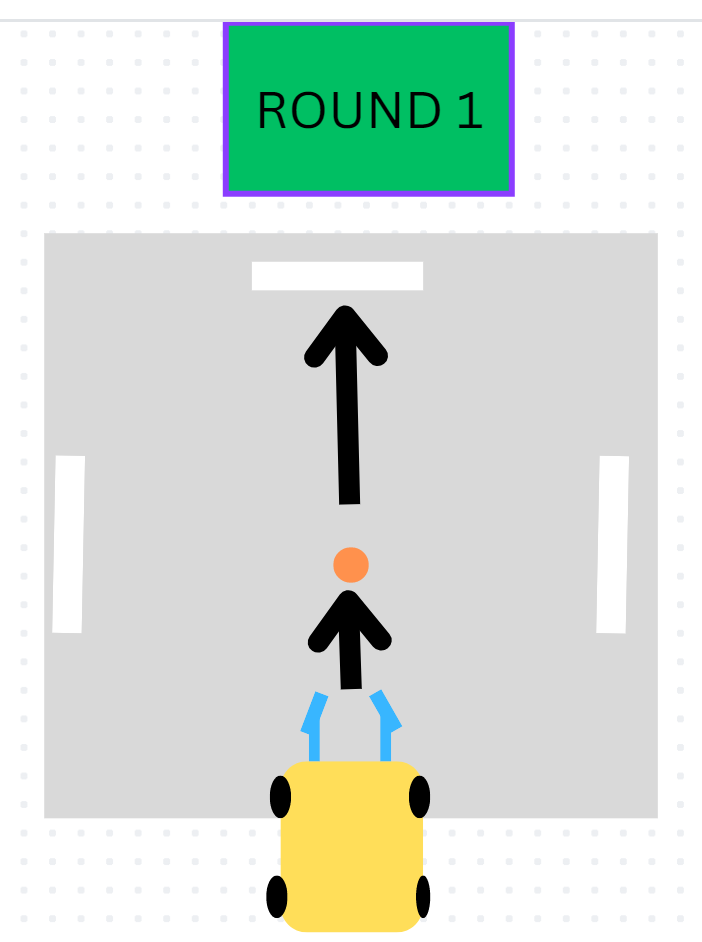

# Lego Spike Soccer Bot Game and Programming Instructions

## The Game

The objective of the game is to build and program a wheeled robot that is able to capture and maneuver a game ball in different directions.

There will be three phases of the game.

In the first phase the robot will move in a straight direction to capture the ball and continue in a straight line to push the ball across the finish line.

In the 2nd phase, the bot will move forward to capture the ball, make a 90 degree turn and deliver the ball across an adjacent finish line.

In the 3rd phase, the bot will move forward to capture the ball,
make a 180 degree turn and deliver the ball across the originating finish line.

## Starting A Program

> Use the "When Program Starts" block
> 
>
> > this block sets the instructions for what the motors or sensors should do when the play button is pressed in the software or the program button is pressed on the top of the robot brain.

## Turning a wheel or tire

> Connect a blue turn motor block to a "When program starts" block. You can set the number of rotations, the rotation direction and the motor connection letter from here.
>
> > In the code block below the motor connected to the "A" port will turn clockwise for 10 rotations.
> > 

## Driving a two-wheeled bot forward

> In order to drive a vehicle forward, the two front tires need to spin in opposite "clock" directions. If you connect motor turn blocks together from top to bottom they will run one at a item, in order. This is not the behavior we want.
>
> One option is to attach different motor turn blocks to separate "When Program Starts" blocks.
> 
>
> In the previous image the motor on port "A" will spin clockwise for 10 rotations and the motor on port "E" will spin counter-clockwise for 10 rotations. This will cause the bot to drive forward for 10 rotations.

## Turning a bot

There are multiple options to turn a wheeled robot.

The first option is to make one motor turn faster than the opposite motor.

The second option is to stop one motor and turn the opposite motor.

The third option is to turn opposing motors in opposite directions.

Another option is to have a tail motor that acts as a rudder to point the robot in the direction you want the robot to travel.

## Utilizing the distance sensors
